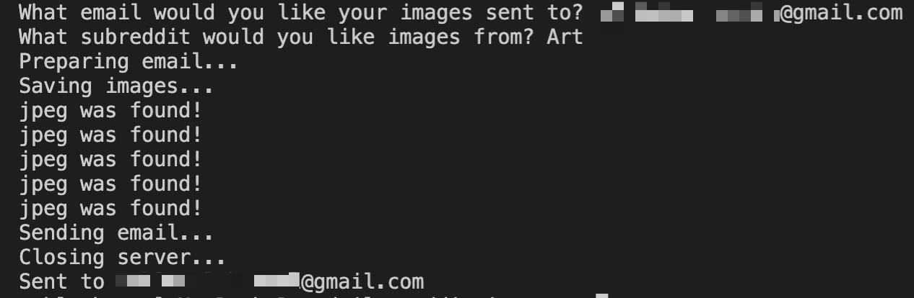
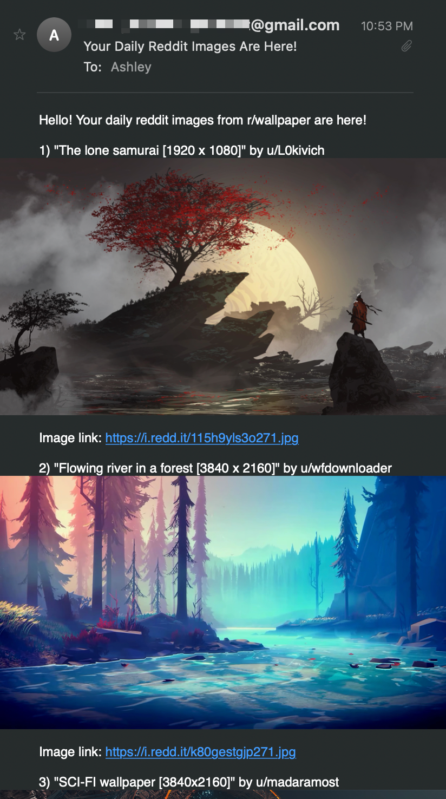

# daily-reddit-images
Saves and emails images/gifs from the top 5 "hot" posts in a user-chosen subreddit.
> (The "daily" part of this project is yet to be implemented)

## General Information
- Quickly collects and saves images of popular art, photography, memes, wallpapers, etc. from Reddit
- Written in Python 3
- Uses PRAW (Reddit API Wrapper), SMTP, MIME, and Requests

## Features
- Sends top 5 images/gifs from a user-chosen subreddit to an inputted email
- Saves images to a file path declared in environment variables
- Pulls email, password, Reddit client ID/secret from local environment variables

## Screenshots
 

## Setup

## Usage

## Room for Improvement
- Provide an HTML format of receiving the images through email
- Schedule script to run daily

## License
This project is open source and available under the MIT License.

